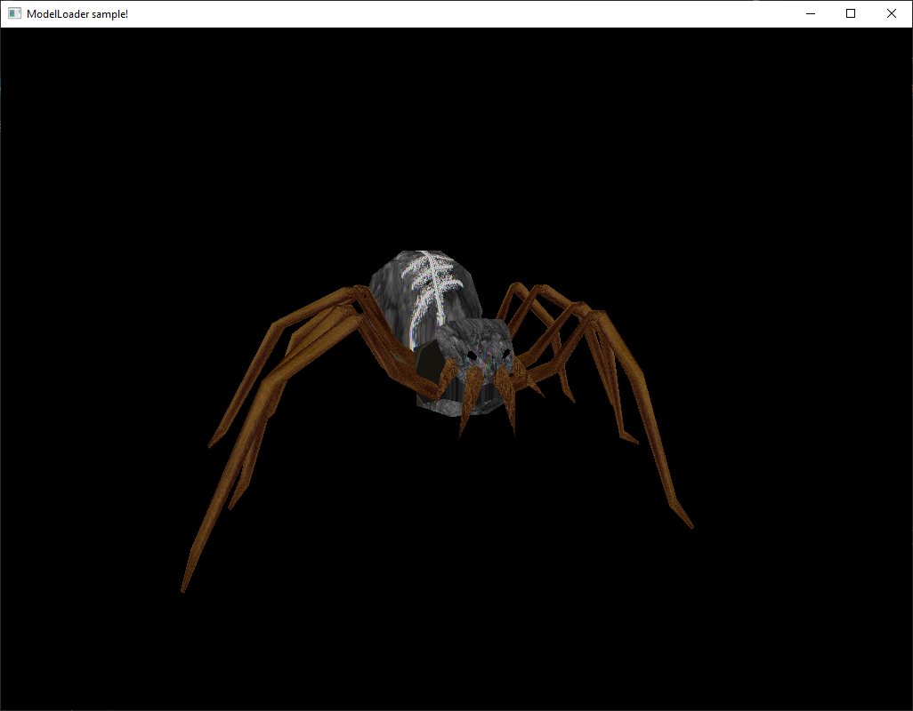

## Mesh Loader

This sample shows how to import a model using Assimp.

```cpp
#include <osre/App/AppBase.h>
#include <osre/Properties/Settings.h>
#include <osre/Scene/Stage.h>
#include <osre/Scene/Node.h>
#include <osre/Scene/View.h>
#include <osre/Assets/AssetRegistry.h>
#include <osre/Assets/AssimpWrapper.h>
#include <osre/Assets/Model.h>
#include <osre/Assets/Model.h>
#include <osre/IO/Uri.h>
#include <osre/Platform/AbstractSurface.h>
#include <osre/RenderBackend/RenderCommon.h>
#include <osre/RenderBackend/RenderBackendService.h>
#include <osre/Common/Ids.h>
#include <osre/Scene/GeometryBuilder.h>

#include <glm/gtc/matrix_transform.hpp>

using namespace ::OSRE;
using namespace ::OSRE::Assets;
using namespace ::OSRE::Common;
using namespace ::OSRE::RenderBackend;
using namespace ::OSRE::Scene;

// To identify local log entries 
static const String Tag = "ModelLoadingApp"; 

static const String ModelPath = "file://assets/Models/Obj/box.obj";

// The example application, will create the render environment and render a simple triangle onto it
class ModelLoadingApp : public App::AppBase {
    Scene::Stage *m_stage;
    Scene::View  *m_view;
    f32 m_angle;
    TransformMatrixBlock m_transformMatrix;

public:
    ModelLoadingApp( int argc, char *argv[] )
    : AppBase( argc, argv )
    , m_stage( nullptr )
    , m_view( nullptr )
    , m_angle( 0.0f )
    , m_transformMatrix() {
        // empty
    }

    virtual ~ModelLoadingApp() {
        // empty
    }

protected:
    bool onCreate( Properties::Settings *settings = nullptr ) override {
        Properties::Settings *baseSettings( AppBase::getSettings() );
        if ( nullptr == baseSettings ) {
            return false;
        }
       
        baseSettings->setString( Properties::Settings::WindowsTitle, "Model Loader!" );
        if ( !AppBase::onCreate( baseSettings ) ) {
            return false;
        }

#ifdef OSRE_WINDOWS
        Assets::AssetRegistry::registerAssetPath( "assets", "../../media" );
#else
        Assets::AssetRegistry::registerAssetPath( "assets", "../media" );
#endif 

        Ids ids;
        Assets::AssimpWrapper assimpWrapper( ids );
        IO::Uri modelLoc( ModelPath );
        if ( assimpWrapper.importAsset( modelLoc, 0 ) ) {
            Assets::Model *model = assimpWrapper.getModel();
            Collision::TAABB<f32> aabb = model->getAABB();

            CPPCore::TArray<Geometry*> geoArray = model->getGeoArray();
            m_transformMatrix.m_model = glm::rotate( m_transformMatrix.m_model, 0.0f, glm::vec3( 1, 1, 0 ) );
            m_transformMatrix.update();
            RenderBackendService *rbSrv( getRenderBackendService() );
            if ( nullptr != rbSrv ) {
                /*rbSrv->setMatrix( "M", m_transformMatrix.m_model );
                rbSrv->setMatrix( "V", m_transformMatrix.m_view );
                rbSrv->setMatrix( "P", m_transformMatrix.m_projection );*/
                rbSrv->setMatrix( "MVP", m_transformMatrix.m_mvp );
                rbSrv->attachGeo( geoArray, 0 );
            }

            Stage *myStage = AppBase::createStage( "ModelLoading" );
        }

        return true;
    }

	// Lets rotate
    void onUpdate( d32 timetick ) override {
        glm::mat4 rot( 1.0 );
        m_transformMatrix.m_model = glm::rotate( rot, m_angle, glm::vec3( 1, 1, 0 ) );
        m_transformMatrix.update();
        m_angle += 0.01f;
        RenderBackendService *rbSrv( getRenderBackendService() );

        AppBase::getRenderBackendService()->setMatrix( "MVP", m_transformMatrix.m_mvp );
        AppBase::onUpdate( timetick );
    }

};

OSRE_MAIN( ModelLoadingApp )
```
At first we are generating our render window as usual. IN the onCreate-Method we will generate the 
assimp-wrapper and import a model with it.

In the onUpdate-callback the model will be rotated.
